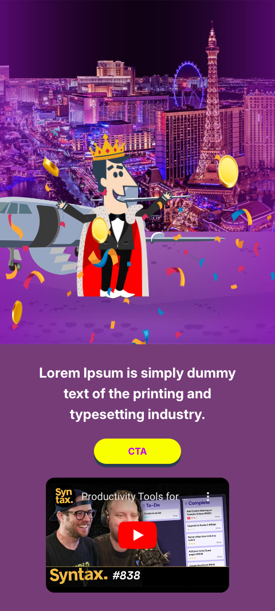
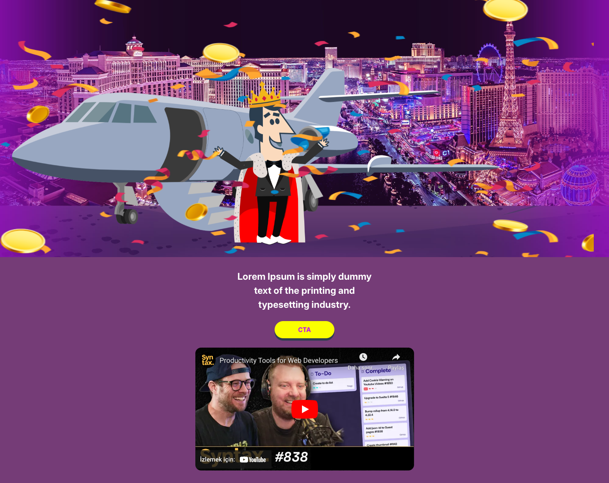
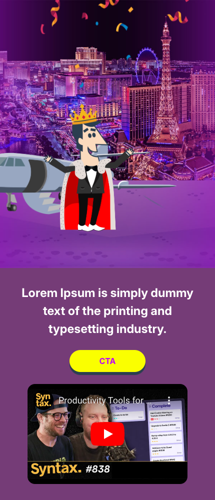
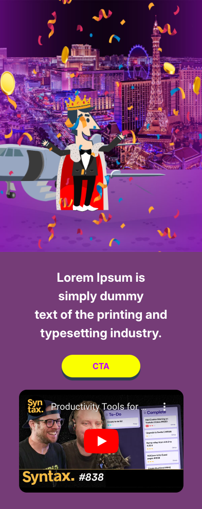
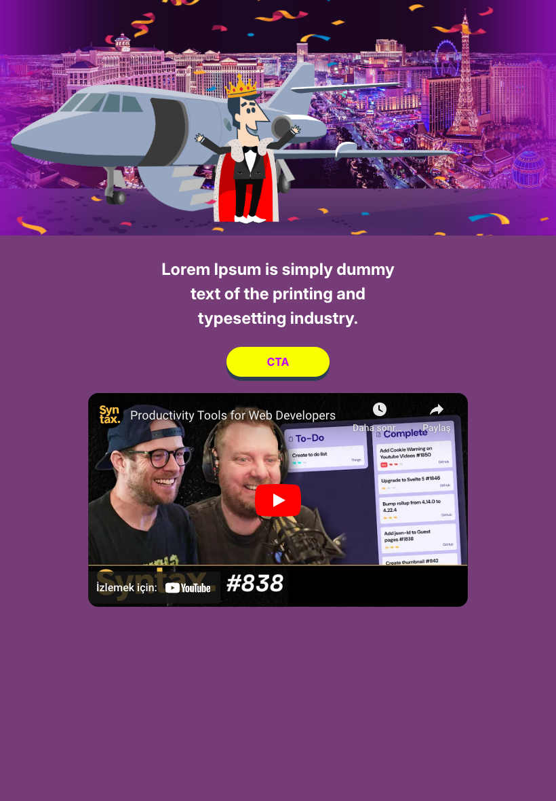

# AdCropper - Engaging Landing Page with Animated Characters

## Live Version

Check out the live version of the landing page [here](https://harmonious-empanada-29c7b8.netlify.app/).

## Tech Stack

- **HTML**: Structure and content of the web page.
- **CSS**: Styling and animations for the web page.
  - Keyframes for animations
  - Media queries for responsive design
- **JavaScript**: Interactivity and dynamic content.
  - DOM manipulation
  - Event handling
- **Assets**: Images and other media files.
  - PNG images for characters, confetti, and coins

## Responsive Design

The landing page is designed to be responsive and looks great on various devices. Below are screenshots of the landing page on different devices:

### Pixel 7 Pro (480x1063)

### MacBook Air (1559x1238)

### iPhone 14 Pro Max (430x1000)

### iPhone 14 Pro (393x990)

### iPad Air (820x1180)

